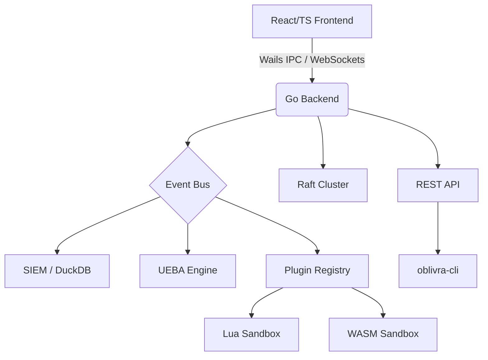

# Sovereign Terminal


**Sovereign Terminal** is a master-level, sovereign threat hunting and unified telemetry platform. It provides unparalleled visibility into endpoint telemetry, an embedded high-performance SIEM, dynamic real-time behavioral analysis (UEBA), and secure distributed node management.

Built for analysts handling top-tier security alerts, Sovereign Terminal combines a blazing-fast React/TypeScript frontend with a robust, zero-trust Go backend powered by DuckDB and Raft consensus.

---

## 🚀 Key Features

*   **Embedded SIEM Database:** Powered by DuckDB, offering high-throughput ingest and complex analytical queries with SQLite-like ease of use.
*   **Real-time Event Streaming:** WebSocket-based event bus for live telemetry visualization and alerting.
*   **User and Entity Behavior Analytics (UEBA):** Real-time behavioral profiling, peer group anomaly detection, and risk scoring.
*   **Extensible Plugin System:** 
    *   **Lua Sandboxes:** Rapid prototyping and scripting.
    *   **WebAssembly (WASM):** Bring your own plugins compiled from Go, Rust, or C++ running in a secure, zero-CGO environment (`tetratelabs/wazero`).
*   **Raft Consensus Cluster:** High-availability architecture utilizing `hashicorp/raft` for distributed state management across nodes.
*   **Zero-Trust Identity Vault:** Secure credential management and RBAC.
*   **Immersive Threat Hunter UI:** A unified interface for investigating alerts, tracing kill chains, and executing rapid response actions.
*   **REST API & CLI:** Full Headless capabilities with OpenAPI 3.0 specification and a dedicated CLI client (`oblivra-cli`).

## 🏗 Architecture Overview

Sovereign Terminal uses a decoupled frontend-backend architecture wrapped in a desktop shell (Wails) or deployed headlessly via Docker.



## 🛠 Getting Started

### Prerequisites

*   **Go** >= 1.24
*   **Bun** (for frontend package management)
*   **Wails v2** CLI (for desktop app builds)

### Build from Source

**1. Desktop App (Wails)**
```bash
# Install Wails CLI if you haven't already
go install github.com/wailsapp/wails/v2/cmd/wails@latest

# Build the desktop application
wails build
```

**2. Headless Backend (API & CLI)**
```bash
# Build the main server
go build -o bin/sovereign-server .

# Build the CLI client
go build -o bin/oblivra-cli ./cmd/cli
```

## ⚙️ Configuration

Sovereign Terminal uses a configuration file typically located at `~/.oblivrashell/oblivra.yaml`.

Example minimal configuration:
```yaml
server:
  port: 8080
  host: "0.0.0.0"
database:
  path: "~/.oblivrashell/siem.duckdb"
plugins:
  dir: "~/.oblivrashell/plugins"
```

## 🐳 Docker Deployment

To run Sovereign Terminal headlessly as a SIEM node or API backend, use the provided Docker artifacts.

```bash
# Start the backend via Docker Compose
docker-compose up -d
```
See the [Deployment Guide](docs/deployment.md) for advanced enterprise setups.

## 🤝 Contributing

Contributions are welcome! Please read our contributing guidelines and submit your PRs.

## 📄 License

This project is licensed under the MIT License - see the LICENSE file for details.
