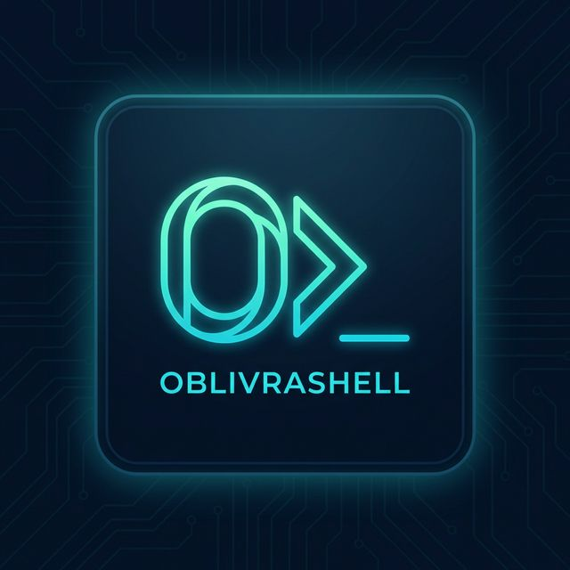

<div align="center">



# OBLIVRA

**Sovereign Security Platform**

*A self-hosted, air-gap-ready SIEM + SSH operations terminal with embedded threat detection, forensics, and compliance — running entirely on your hardware.*

[](https://go.dev)
[](https://svelte.dev)
[](https://wails.io)
[](#license)
[](#changelog)
[](#building-from-source)

---

[Features](#features) · [Architecture](#architecture) · [Quick Start](#quick-start) · [Building](#building-from-source) · [Configuration](#configuration) · [Detection Rules](#detection-rules) · [API](#api-reference) · [Deployment](#deployment) · [Contributing](#contributing)

</div>

---

## Overview

OBLIVRA is a **full-stack sovereign security platform** built for security engineers and SOC analysts who need professional-grade tooling without cloud dependencies, vendor lock-in, or per-seat licensing. It ships as a native desktop application (Wails v3 shell) and a headless REST server, both backed by the same Go engine.

**What it does in one sentence:** ingest logs at 18k+ EPS, run Sigma & custom detection rules, correlate threats against MITRE ATT&CK, manage SSH sessions across your fleet, store forensic evidence in a signed chain-of-custody ledger, and enforce RBAC + multi-tenancy — all from a single binary on your own hardware.

### Why OBLIVRA?

| Concern | How OBLIVRA addresses it |
|---|---|
| **Data sovereignty** | Everything runs on-device or on-prem. No telemetry. No SaaS callbacks. |
| **Air-gap ready** | Offline threat intel, offline updates, local Sigma rule evaluation. |
| **No per-seat cost** | Self-hosted. Bring your own hardware. |
| **Zero runtime dependencies** | Single binary. BadgerDB + SQLite embedded. No Kafka, no Elasticsearch. |
| **Audit-grade integrity** | Merkle-chained audit logs, HMAC-signed evidence, TPM-bound vault. |

---

## Features

### 🖥️ Terminal & SSH Operations

- **Multi-session terminal grid** — simultaneous local (PTY) + SSH tabs with instant switching
- **Multi-exec broadcast** — run a single command across your entire fleet at once
- **SSH tunneling** — integrated port forwarding and SOCKS5 proxy
- **SFTP file browser** — drag-and-drop file management, directory diff, background transfers
- **Session recording** — TTY capture with full playback for audit and training
- **Jump host chains** — multi-hop SSH with credential injection from vault at each hop
- **Key deployment** — generate and deploy ED25519 keys to remote hosts in one click

### 🛡️ Encrypted Vault

- **AES-256-GCM** encryption with **Argon2id** key derivation
- **OS keychain integration** — Windows DPAPI, macOS Keychain, Linux Secret Service
- **FIDO2 / YubiKey** hardware MFA for vault unlock
- **TPM PCR binding** — vault can be locked to the current hardware state
- **Nuclear wipe** — multi-pass cryptographic erasure of vault and all secrets

### 📡 Embedded SIEM — 18,000+ EPS

- **Unified ingest** — Syslog (RFC5424/3164), JSON, CEF, LEEF, and raw lines
- **Write-ahead log (WAL)** — zero data loss on crash or restart
- **Hot store** — BadgerDB for sub-second event lookup
- **Full-text index** — Bleve for field-level search, aggregations, and histograms
- **Columnar archive** — Parquet for long-term forensic storage
- **Live tail** — real-time event stream with <100 ms latency via WebSocket
- **Multi-syntax query** — OQL (native), Sigma, KQL, SPL transpiler

### 🔍 Detection Engine

- **Sigma native** — load and execute community `.yml` Sigma rules directly; hot-reload from `sigma/` directory
- **80+ built-in rules** covering the full MITRE ATT&CK matrix (Windows, Linux, Cloud AWS/Azure/GCP, network, OT)
- **Rule types** — Threshold, Frequency, Sequence, Temporal, Correlation, and Graph-based rules
- **MITRE ATT&CK heatmap** — live tactic/technique coverage visualization
- **Fusion engine** — cross-host campaign builder correlating events into attack chains
- **Counterfactual engine** — "what-if" detection replay for rule tuning

### 🧠 Threat Intelligence

- **STIX/TAXII client** — automated feed ingestion
- **O(1) IOC matching** — IP, hash, domain, URL lookups against known-bad indicators
- **Enrichment pipeline** — GeoIP, DNS PTR/ASN, asset mapping on every event
- **SSRF-safe feed fetching** — private IP blocklist enforced at dial time

### 🔬 Forensics & Evidence

- **Evidence locker** — HMAC-signed artifacts with chain-of-custody tracking
- **Merkle tree audit log** — tamper-evident, cryptographically immutable
- **Chain of custody** — forensic sealing, baseline diffing, export package
- **TPM signing** — evidence entries optionally signed by hardware TPM
- **Temporal integrity** — detects clock drift and late-arriving event manipulation

### 📋 Compliance

- **Built-in packs** — PCI-DSS, NIST 800-53, SOC2 Type II, ISO 27001, HIPAA, GDPR
- **Regulator portal** — export timestamped, integrity-proven compliance packages
- **Policy evaluator** — continuous scoring of infrastructure against control objectives
- **GDPR crypto-wipe** — DoD-compliant selective data destruction

### 🚨 Advanced Detection Modules

- **UEBA engine** — Isolation Forest anomaly scoring + peer-group baselining
- **Ransomware defense** — entropy analysis, canary file monitoring, automated network isolation
- **NDR** — NetFlow/IPFIX collector, DNS tunnel detection, lateral movement analysis
- **eBPF agent** — Linux kernel instrumentation for processes, network, file events
- **Purple team** — built-in adversary emulation for continuous detection coverage testing

### 🏢 Enterprise Features

- **Multi-tenancy** — per-tenant data isolation enforced at every query
- **RBAC** — Admin / Analyst / ReadOnly / Agent roles with fine-grained permission constants
- **OIDC / SAML 2.0** — federated identity with SCIM 2.0 provisioning
- **TOTP MFA** — software MFA for local accounts
- **HA clustering** — Hashicorp Raft consensus for multi-node state synchronization
- **SOAR playbooks** — automated response actions with M-of-N approval workflow
- **MCP protocol** — model context protocol for AI-assisted investigation

### 🔌 Plugin System

- **Lua sandbox** — isolated execution with permission manifest and CPU/time limits
- **WebAssembly plugins** — Wazero-based WASM sandbox for high-performance extensions
- **Signed manifests** — cryptographic verification before plugin load

### 📊 Observability

- **Prometheus metrics** — goroutines, heap, ingest EPS, detection rate, SSH latency
- **OpenTelemetry tracing** — OTLP-compatible distributed traces
- **Pre-built Grafana dashboard** — provisioned automatically via `docker-compose`
- **Runtime attestation** — binary hash verification at `/debug/attestation`
- **Self-diagnostics** — live health panel with service status and goroutine counts

---

## Architecture

```
┌─────────────────────────────────────────────────────────────┐
│                     OBLIVRA Platform                        │
│                                                             │
│  ┌─────────────┐    ┌──────────────────────────────────┐   │
│  │  Desktop UI │    │         Headless Server           │   │
│  │  (Wails v3) │    │   REST API  ·  WebSocket Events   │   │
│  │  Svelte 5   │    │   SCIM 2.0  ·  MCP Protocol       │   │
│  └──────┬──────┘    └───────────────┬──────────────────┘   │
│         │                           │                        │
│         └──────────────┬────────────┘                       │
│                        ▼                                     │
│  ┌─────────────────────────────────────────────────────┐   │
│  │                  Service Layer (Go)                   │   │
│  │  SSH · Vault · SIEM · Detection · Forensics · UEBA   │   │
│  │  SOAR · Compliance · NDR · ThreatIntel · Cluster     │   │
│  └──────┬──────────────────────────────────────┬───────┘   │
│         │                                        │           │
│  ┌──────▼──────┐                    ┌───────────▼────────┐ │
│  │  Ingest &   │                    │   Auth & Vault      │ │
│  │  Detection  │                    │   AES-256-GCM       │ │
│  │  Engine     │                    │   Argon2id KDF      │ │
│  │  18k+ EPS   │                    │   TPM / FIDO2       │ │
│  └──────┬──────┘                    └────────────────────┘ │
│         │                                                    │
│  ┌──────▼──────────────────────────────────────────────┐   │
│  │                  Storage Layer                        │   │
│  │  BadgerDB (hot)  ·  Bleve (index)  ·  Parquet (cold) │   │
│  │  SQLite/SQLCipher (meta)  ·  WAL (crash safety)      │   │
│  └──────────────────────────────────────────────────────┘   │
└─────────────────────────────────────────────────────────────┘

       ┌──────────┐        ┌──────────────┐
       │  eBPF    │        │  Raft Cluster │
       │  Agent   │◄──────►│  (HA Mode)    │
       └──────────┘        └──────────────┘
```

### Deployment Modes

| Mode | Description | Use Case |
|---|---|---|
| **Desktop (Wails)** | Native GUI app with embedded engine | Individual analyst workstation |
| **Headless (REST)** | Go binary serving REST + WebSocket API | SOC server, docker-compose, HA cluster |
| **Hybrid** | Desktop app connected to remote server | Remote analyst + central data |

### Tech Stack

| Layer | Technology |
|---|---|
| Backend language | Go 1.25 |
| Desktop shell | Wails v3 (WebView2 / WebKit) |
| Frontend | Svelte 5 + TypeScript + Tailwind CSS 4 |
| Hot storage | BadgerDB v4 |
| Full-text index | Bleve v2 |
| Metadata DB | SQLite / SQLCipher (encrypted) |
| Columnar archive | Parquet (parquet-go) |
| Consensus | Hashicorp Raft v1.7 |
| Messaging | NATS (embedded) |
| Plugin runtime | Gopher-Lua + Wazero (WASM) |
| Crypto | AES-256-GCM, Argon2id, Ed25519, HMAC-SHA256 |
| Observability | OpenTelemetry + Prometheus |

---

## Quick Start

### Prerequisites

| Tool | Minimum Version | Install |
|---|---|---|
| Go | 1.25 | [go.dev/dl](https://go.dev/dl/) |
| Wails CLI | v3.0 | `go install github.com/wailsapp/wails/v3/cmd/wails@latest` |
| Node.js / Bun | Node 20+ / Bun latest | [bun.sh](https://bun.sh) |
| WebView2 | Any | Windows — usually pre-installed; [download if missing](https://developer.microsoft.com/en-us/microsoft-edge/webview2/) |

### 1. Clone & Install

```bash
git clone https://github.com/kingknull/oblivra.git
cd oblivra
go mod tidy
cd frontend && bun install && cd ..
```

### 2. Run in Development Mode

```bash
wails dev
```

This starts the Go backend and Vite dev server with hot-reload. The desktop window opens automatically.

### 3. First Launch — Vault Setup

1. The **Vault Gate** appears on first run.
2. Click **Set up new vault** and choose a strong master passphrase.
3. This passphrase encrypts all credentials and the database with AES-256-GCM + Argon2id. **There is no recovery mechanism** — store it in a password manager.
4. On all subsequent launches, enter the passphrase to unlock.

### 4. Add Your First Host

1. Navigate to **Hosts** in the left rail.
2. Click **+ New Host** (or `Ctrl/Cmd+N`).
3. Enter hostname, port, username, and authentication method (password stored in vault, or SSH key).
4. Click the host to open a terminal session.

### 5. Start Log Ingestion

**Syslog (UDP/TCP — default port 1514):**
```bash
# Point any log shipper at:
<your-machine-ip>:1514

# Quick test:
echo '<34>1 2026-01-01T00:00:00Z web-01 sshd - - Failed password for root from 10.0.0.1 port 22 ssh2' | \
  nc -u 127.0.0.1 1514
```

**REST API:**
```bash
curl -X POST http://localhost:8080/api/v1/siem/ingest \
  -H "Authorization: Bearer <your-api-token>" \
  -H "Content-Type: application/json" \
  -d '{"host_id":"web-01","event_type":"failed_login","raw_log":"Failed password for root"}'
```

**eBPF Agent (Linux endpoints):**
```bash
./oblivra-agent --server <server-ip>:8443 --token <api-token>
```

### 6. Keyboard Shortcuts

| Shortcut | Action |
|---|---|
| `Ctrl/Cmd + K` | Command palette |
| `Ctrl/Cmd + N` | Add new host |
| `Ctrl/Cmd + B` | Toggle sidebar |
| `Ctrl/Cmd + ,` | Settings |
| `Ctrl/Cmd + Shift + F` | Focus mode |
| `Ctrl+Click` nav item | Open as floating panel |

---

## Building from Source

### Desktop Application

```bash
# Windows
wails build
# Output: build/bin/oblivrashell.exe

# macOS
wails build
# Output: build/bin/oblivrashell

# Linux
wails build
# Output: build/bin/oblivrashell
```

### Headless Server Only

```bash
go build -tags production -trimpath -ldflags "-w -s" -o oblivra-server ./cmd/server
```

### Agent Binary

```bash
go build -tags production -trimpath -ldflags "-w -s" -o oblivra-agent ./cmd/agent
```

### CLI Tool

```bash
go build -o oblivra-cli ./cmd/cli
```

### Docker

```bash
docker-compose up -d
```

This starts the headless server plus the full observability stack:

| Service | Port | Description |
|---|---|---|
| OBLIVRA API | 8080 | REST + WebSocket |
| Raft cluster | 8443 | HA consensus + agent ingest |
| Syslog | 1514 | UDP/TCP log ingestion |
| Prometheus | 9090 | Metrics scrape |
| Grafana | 3000 | Dashboards (admin / oblivra) |
| Grafana Tempo | 3200 | Distributed traces |

### Build Flags

| Tag | Effect |
|---|---|
| `production` | Enables SQLCipher encryption, disables stub handlers, enforces TLS |
| `sqlcipher` | Links against SQLCipher for encrypted SQLite |
| `pure` | Uses pure-Go SQLite (no CGO required) |

---

## Configuration

### Data Directories

| Platform | Path |
|---|---|
| Windows | `%LOCALAPPDATA%\sovereign-terminal\` |
| macOS | `~/Library/Application Support/sovereign-terminal/` |
| Linux | `~/.local/share/sovereign-terminal/` |

```
sovereign-terminal/
├── data/
│   ├── siem_hot.badger/    # Hot SIEM event store (BadgerDB)
│   ├── wal/ingest.wal      # Write-ahead log — never delete manually
│   ├── bleve.idx/          # Full-text search index
│   ├── analytics.db        # SQLite — alerts, incidents, metadata
│   ├── sigma/              # Drop .yml Sigma rules here — hot-reloaded
│   └── rules/              # Native YAML detection rules
├── plugins/                # Plugin directories (id/manifest.json + main.lua)
├── oblivra.vault           # AES-256-GCM encrypted vault
└── oblivra.log             # Application log
```

### Environment Variables

| Variable | Default | Description |
|---|---|---|
| `OBLIVRA_ENV` | `dev` | Set to `production` to enforce TLS, disable stubs, enable SQLCipher |
| `OBLIVRA_PORT` | `8080` | REST API listen port |
| `OBLIVRA_RAFT_PORT` | `8443` | Raft consensus + agent ingest port |
| `OBLIVRA_SYSLOG_PORT` | `1514` | Syslog UDP/TCP listener port |
| `OBLIVRA_API_KEYS` | — | Comma-separated list of API keys for headless mode |
| `OBLIVRA_FLEET_SECRET` | — | Shared HMAC secret for agent authentication |

### App Config (`config.json`)

The application config is stored alongside the vault and supports the following keys (all settable via **Settings** UI):

```json
{
  "font_family": "JetBrains Mono, Fira Code, monospace",
  "font_size": 14,
  "theme": "dark",
  "auto_lock_timeout": 15,
  "clipboard_clear": 30,
  "log_sessions": true,
  "keepalive_interval": 30,
  "connection_timeout": 10,
  "scrollback_lines": 10000
}
```

---

## Detection Rules

### Sigma Rules

OBLIVRA natively executes Sigma rules. Drop any `.yml` file into the `sigma/` data directory — they are hot-reloaded without restart.

```yaml
# sigma/custom_rule.yml
title: Suspicious PowerShell Download
status: stable
logsource:
    product: windows
    category: process_creation
detection:
    selection:
        CommandLine|contains:
            - 'DownloadString'
            - 'Invoke-Expression'
    condition: selection
tags:
    - attack.execution
    - attack.t1059.001
falsepositives:
    - Legitimate admin tooling
level: high
```

### Native YAML Rules

For high-performance rules with OBLIVRA-specific capabilities:

```yaml
# data/rules/my_rule.yaml
id: custom-bruteforce-001
name: SSH Brute Force Detected
type: threshold
event_type: failed_login
field: src_ip
threshold: 10
window: 60s
severity: high
mitre_attack: T1110
response_actions:
  - type: isolate_host
    target: src_ip
```

### Rule Types

| Type | Description |
|---|---|
| `threshold` | Fire when field count exceeds N within time window |
| `frequency` | Fire on N distinct values of a field |
| `sequence` | Ordered event chain with correlation window |
| `temporal` | Time-based patterns (e.g., off-hours access) |
| `correlation` | Cross-event field linkage |
| `graph` | Multi-hop entity relationship rules |

### Built-in Rule Coverage

80+ built-in rules covering:

- **Windows** — LSASS dump, Pass-the-Hash, Golden Ticket, DCSync, Shadow Copy deletion, PowerShell encoded commands, registry run keys, WMI lateral movement, LOLBins
- **Linux** — SSH brute force, rootkit indicators, LD_PRELOAD hijack, kernel module load, Docker escape, SSH key injection, cron persistence
- **Cloud** — AWS IAM escalation, S3 exfiltration, Azure impossible travel, GCP suspicious IAM
- **Network** — DNS tunneling, C2 beaconing, SMB lateral movement, firewall sweep
- **Ransomware** — Backup deletion, volume shadow removal, high-entropy file writes

---

## API Reference

The headless server exposes a REST API on port 8080. Full OpenAPI 3.0 spec: `docs/openapi.yaml`.

### Authentication

All endpoints require either:
- `Authorization: Bearer <token>` header
- `X-API-Key: <key>` header

Exempt (no auth required): `/api/v1/auth/login`, `/api/v1/auth/oidc/*`, `/healthz`, `/readyz`

### Core Endpoints

```
GET  /healthz                          # Liveness probe
GET  /readyz                           # Readiness probe
GET  /metrics                          # Prometheus metrics

POST /api/v1/auth/login                # Local login
GET  /api/v1/auth/oidc/login           # OIDC redirect
GET  /api/v1/auth/oidc/callback        # OIDC callback
GET  /api/v1/auth/me                   # Current user info

GET  /api/v1/siem/search               # Search SIEM events
POST /api/v1/siem/search               # Search with filters
GET  /api/v1/alerts                    # List active alerts

GET  /api/v1/mitre/heatmap             # ATT&CK coverage

GET  /api/v1/threatintel/indicators    # List IOC indicators
GET  /api/v1/threatintel/lookup?value= # Check single value
GET  /api/v1/enrich?q=                 # Enrich IP/host

GET  /api/v1/forensics/evidence        # List evidence items
POST /api/v1/forensics/evidence/{id}/seal  # Seal evidence

GET  /api/v1/audit/log                 # Audit trail
POST /api/v1/audit/packages/generate   # Generate compliance package

GET  /api/v1/agent/fleet               # Registered agents
POST /api/v1/agent/register            # Register new agent
POST /api/v1/agent/ingest              # Agent event ingest

GET  /api/v1/ueba/profiles             # UEBA entity profiles
GET  /api/v1/ueba/anomalies            # Current anomalies

GET  /api/v1/graph/subgraph?node_id=   # Entity relationship graph

GET  /api/v1/mcp/tools                 # MCP tool discovery
POST /api/v1/mcp/execute               # Execute MCP tool
POST /api/v1/mcp/approve               # Approve MCP action

GET  /api/v1/dashboards                # List dashboards
POST /api/v1/reports/generate          # Generate compliance report

GET  /debug/attestation                # Binary integrity status (admin)
```

### WebSocket — Live Event Stream

```
GET /api/v1/events?token=<api-token>
```

Connect with any WebSocket client. All platform events are broadcast in real time:

```json
{
  "type": "detection.alert",
  "timestamp": "2026-04-19T12:00:00Z",
  "payload": {
    "rule_id": "windows-lsass-dump",
    "severity": "critical",
    "host": "dc01",
    "mitre_attack": "T1003.001"
  }
}
```

### Example: SIEM Search

```bash
# Search for failed logins in last hour
curl -s "http://localhost:8080/api/v1/siem/search?q=EventType:failed_login" \
  -H "Authorization: Bearer $OBLIVRA_TOKEN" | jq .

# POST with filters
curl -s -X POST http://localhost:8080/api/v1/siem/search \
  -H "Authorization: Bearer $OBLIVRA_TOKEN" \
  -H "Content-Type: application/json" \
  -d '{"query": "src_ip:10.0.0.0/8", "filters": {"limit": 500}}'
```

---

## Deployment

### Single Node (Docker Compose)

```bash
git clone https://github.com/kingknull/oblivra.git
cd oblivra
OBLIVRA_ENV=production \
OBLIVRA_API_KEYS=your-strong-key-here \
OBLIVRA_FLEET_SECRET=your-fleet-hmac-secret \
docker-compose up -d
```

### High Availability Cluster (3 Nodes)

```bash
# Node 1 — bootstrap
OBLIVRA_ENV=production \
OBLIVRA_RAFT_ID=node1 \
./oblivra-server

# Node 2 — join
OBLIVRA_ENV=production \
OBLIVRA_RAFT_ID=node2 \
OBLIVRA_RAFT_JOIN=node1:8443 \
./oblivra-server

# Node 3 — join
OBLIVRA_ENV=production \
OBLIVRA_RAFT_ID=node3 \
OBLIVRA_RAFT_JOIN=node1:8443 \
./oblivra-server
```

### TLS / Reverse Proxy (Recommended for Production)

OBLIVRA generates a self-signed CA and localhost certificate on first start. For production:

1. Place your signed certificates at `~/.oblivrashell/cert.pem` and `~/.oblivrashell/key.pem`.
2. The server will automatically use TLS with TLS 1.3 minimum.
3. Alternatively, place OBLIVRA behind Nginx/Traefik and handle TLS at the proxy:

```nginx
server {
    listen 443 ssl;
    server_name oblivra.internal;
    ssl_certificate     /etc/ssl/certs/oblivra.crt;
    ssl_certificate_key /etc/ssl/private/oblivra.key;
    ssl_protocols       TLSv1.3;

    location / {
        proxy_pass http://127.0.0.1:8080;
        proxy_http_version 1.1;
        proxy_set_header Upgrade $http_upgrade;
        proxy_set_header Connection "upgrade";
        proxy_set_header Host $host;
    }
}
```

### Observability Stack

```bash
docker-compose up -d
```

| Dashboard | URL | Default Credentials |
|---|---|---|
| Grafana | http://localhost:3000 | admin / oblivra |
| Prometheus | http://localhost:9090 | — |
| Grafana Tempo | http://localhost:3200 | — |

---

## Agent Deployment

The OBLIVRA agent provides kernel-level telemetry for Linux endpoints (eBPF) and process/network visibility for Windows/macOS.

```bash
# Linux — with eBPF (requires root)
sudo ./oblivra-agent \
  --server oblivra-server:8443 \
  --token <fleet-api-token> \
  --collectors ebpf,process,network,file

# macOS / Windows — without eBPF
./oblivra-agent \
  --server oblivra-server:8443 \
  --token <fleet-api-token> \
  --collectors process,network
```

The agent authenticates via HMAC-SHA256 signed requests. Generate fleet tokens from the **Fleet Dashboard** or via CLI:

```bash
./oblivra-cli agent token create --name "prod-web-01" --role agent
```

---

## Plugin Development

Plugins are loaded from `~/.oblivrashell/plugins/<plugin-id>/`.

### Manifest (`manifest.json`)

```json
{
  "id": "my-enricher",
  "name": "Custom IP Enricher",
  "version": "1.0.0",
  "main": "main.lua",
  "timeout_sec": 30,
  "permissions": [
    "events.read",
    "siem.write"
  ]
}
```

### Lua Plugin (`main.lua`)

```lua
-- Called by OBLIVRA on every ingest event
function on_event(event)
  if event.event_type == "network_connection" then
    oblivra.print("Processing: " .. event.src_ip)
    -- Enrich, filter, or forward events
  end
end

-- Register a UI panel
oblivra.ui.register_panel("my-panel", "My Enricher", "shield")
```

### WebAssembly Plugin

Compile any language to WASM and place the `.wasm` file alongside `manifest.json`. The Wazero runtime provides sandboxed execution with the same permission model.

---

## Compliance Packs

OBLIVRA ships with pre-built compliance evaluation packs:

| Pack | Standard | Controls |
|---|---|---|
| `pci_dss.yaml` | PCI-DSS v4.0 | Requirements 10, 11, 12 |
| `nist_800_53.yaml` | NIST 800-53 Rev 5 | AC, AU, CA, CM, IA, IR, SI |
| `soc2_type2.yaml` | SOC 2 Type II | CC6, CC7, CC8, CC9 |
| `iso_27001.yaml` | ISO/IEC 27001:2022 | A.8, A.9, A.12, A.16 |
| `hipaa.yaml` | HIPAA Security Rule | 164.312 |
| `gdpr.yaml` | GDPR Articles 25, 32 | Access control, logging, breach detection |

Generate a signed compliance package for any framework:

```bash
curl -X POST http://localhost:8080/api/v1/audit/packages/generate \
  -H "Authorization: Bearer $TOKEN" \
  -H "Content-Type: application/json" \
  -d '{"framework": "SOC2", "from": "2026-01-01", "to": "2026-03-31"}'
```

---

## Roadmap

| Phase | Status | Capabilities |
|---|---|---|
| Phase 0–5 | ✅ Validated | Storage, Ingest (18k EPS burst / 10k EPS sustained), Alerts, ThreatIntel, MITRE, OQL |
| Phase 6 | 🟡 Partial — self-validated | SSH/PTY, Vault, Terminal Grid, SFTP, FIDO2, Forensics, Compliance *(third-party compliance audit pending)* |
| Phase 7 | ✅ Validated | Agent Framework (eBPF, FIM, WAL, gRPC) |
| Phase 8–10 | ✅ Validated | SOAR, Ransomware Defense, UEBA, Case Management |
| Phase 11–12 | ✅ Shipped | NDR, Multi-tenancy (per-tenant Bleve index + encryption), HA Cluster, LDAP/Okta connectors |
| Phase 17–19 | ✅ Shipped | Sigma transpiler, OpenTelemetry, supply chain (SBOM + cosign + SLSA) |
| Phase 20 | ✅ Shipped | OQL, SCIM, identity connectors, automated triage, report factory, dashboard studio |
| Phase 21 | ✅ Shipped | Partitioned event pipeline (8 shards), WAL fsync window, enrichment LRU, rule route index |
| Phase 22 | 🔨 Active | Productization: 22.1 chaos harness + soak regression ✅ · 22.2 multi-tenant isolation ✅ · 22.3 storage tiering 🔨 |
| Phase 23 | ✅ Shipped | Terminal UX: SSH bookmarks, session restore, per-host history *(operator banner UI partial)* |
| Phase 26 | 🔨 Partial | NATS JetStream log fabric ✅ · graph investigations ✅ · timeline reconstruction ✅ · M-of-N quorum hardware-binding 🔨 |
| Phase 27 | Planned | BYOK/CMK, SCIM 2.0 deprovisioning, OQL piped analytics, temporal entity resolution, central DLP |

---

## Security

### Reporting Vulnerabilities

**Please do not open public GitHub issues for security vulnerabilities.**

Contact: `security@[your-domain]`

Include: description of the issue, steps to reproduce, impact assessment, and any suggested fix. We aim to respond within 48 hours and issue a patch within 14 days of confirmed receipt.

### Security Model

- **Vault** — AES-256-GCM with Argon2id KDF; master key never leaves process memory; zeroed on lock
- **Transport** — TLS 1.3 minimum for all server connections; HMAC-SHA256 signed agent requests
- **Multi-tenancy** — Structurally enforced: per-tenant BadgerDB keyspace (`tenant:{id}:events:...`), one Bleve index per tenant, per-tenant AES-256 keys derived via HMAC. Cross-tenant queries are physically impossible — there is no shared index to escape. Auth middleware plumbs the authenticated tenant via `database.WithTenant(ctx, ...)`; user input cannot influence the tenant scope.
- **Plugins** — Lua and WASM sandboxes with explicit permission manifests; signed manifest verification before load
- **Audit** — All admin actions written to a Merkle-chained, append-only audit log
- **License-gated APIs** — Premium endpoints (SOAR, UEBA, NDR, Ransomware) check `licensing.Feature*` before executing. Destructive actions like `POST /api/v1/ransomware/isolate` reject without a valid feature claim regardless of caller (Wails or REST).
- **Dependencies** — SBOM generated on every release (SPDX + CycloneDX); Grype, gosec, gitleaks, and govulncheck run on every PR (SARIF uploaded to GitHub Security tab)

A full static code and security vulnerability audit report is available in [`docs/🔴 OBLIVRA — Deep Audit.md`](docs/) and the accompanying [`OBLIVRA_Security_Audit.docx`](docs/).

---

## Contributing

Contributions are welcome. Please read this section before opening a PR.

### Development Setup

```bash
# Clone and install dependencies
git clone https://github.com/kingknull/oblivra.git
cd oblivra
go mod tidy
cd frontend && bun install && cd ..

# Run tests
go test ./...

# Run with race detector
go test -race ./...

# Run fuzz tests (1 minute)
go test -fuzz=FuzzSigmaTranspile ./internal/detection/ -fuzztime=60s
go test -fuzz=FuzzAutoparse ./internal/ingest/ -fuzztime=60s

# Architecture boundary tests
go test ./tests/

# Check architecture rules
go test ./internal/architecture/
```

### Code Style

- Follow standard Go conventions (`gofmt`, `golangci-lint`)
- New security-sensitive packages must include a `_test.go` with at least one fuzz target
- All credential handling must use `vault.ZeroSlice` or `SecureBytes` — never `string` for secrets
- New HTTP handlers must have: method check, RBAC check, body size limit, tenant scope enforcement
- No `fmt.Sprintf` for SQL query construction — use prepared statements

### Commit Convention

```
feat(detection): add Kerberoasting sequence rule
fix(vault): zero canary on failed unlock attempt
sec(api): enforce RBAC on /audit/packages endpoint
docs(quickstart): add HA cluster bootstrap steps
```

### Pull Request Checklist

- [ ] `go test ./...` passes with `-race`
- [ ] New endpoints have RBAC checks
- [ ] No hardcoded credentials or tokens
- [ ] Sensitive fields tagged `json:"-"` in models
- [ ] `go vet ./...` clean
- [ ] Fuzz test added for any new parser or untrusted input handler

---

## License

OBLIVRA is proprietary software. All rights reserved.

See `LICENSE.txt` for full terms.

---

## Acknowledgements

OBLIVRA is built on the shoulders of excellent open-source projects:

[BadgerDB](https://github.com/dgraph-io/badger) · [Bleve](https://github.com/blevesearch/bleve) · [Wails](https://wails.io) · [Svelte](https://svelte.dev) · [Hashicorp Raft](https://github.com/hashicorp/raft) · [Wazero](https://github.com/tetratelabs/wazero) · [Gopher-Lua](https://github.com/yuin/gopher-lua) · [go-oidc](https://github.com/coreos/go-oidc) · [crewjam/saml](https://github.com/crewjam/saml) · [xterm.js](https://xtermjs.org) · [Tailwind CSS](https://tailwindcss.com)

---

<div align="center">
<sub>Built by KingKnull · Sovereign Security · 2026</sub>
</div>
