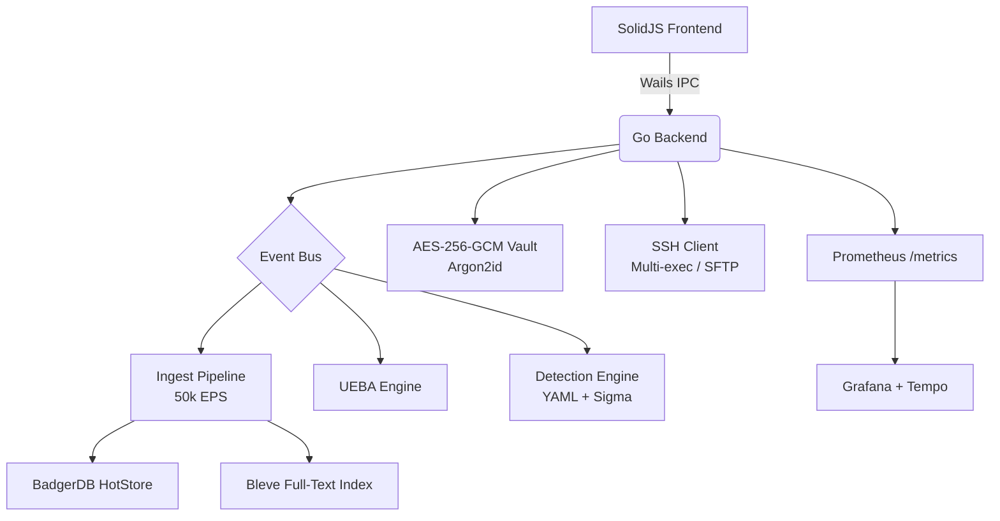

# Oblivra Sovereign Terminal

[](https://github.com/kingknull/oblivrashell/actions)
[](https://golang.org)
[](LICENSE)
[](https://github.com/kingknull/oblivrashell/releases)

**Oblivra Sovereign Terminal** is an enterprise-grade, air-gap-ready security operations platform built for analysts who need full-spectrum visibility — without sending telemetry to a cloud vendor.

It combines a native SSH/terminal client, an embedded SIEM pipeline, Sigma detection engine, UEBA behavioural analytics, a cryptographic credential vault, and a full incident response suite into a single signed desktop binary for Windows, macOS, and Linux.

---

## What it is

A **Wails v2** desktop application (Go backend + SolidJS frontend) that runs entirely on-device. No SaaS. No agents phoning home. The only network connections are the ones you initiate.

| Layer | Technology |
|---|---|
| Desktop shell | Wails v2 (WebView2 / WKWebView) |
| Frontend | SolidJS + ECharts + xterm.js |
| Backend | Go 1.25, BadgerDB, Bleve |
| Vault | AES-256-GCM + Argon2id, OS keychain integration |
| Detection | YAML rules + Sigma transpiler (35+ field modifiers) |
| Observability | OpenTelemetry API, Prometheus metrics on `/metrics` |
| Supply chain | cosign keyless signing, SPDX + CycloneDX SBOM, SLSA attestation |

---

## Key capabilities

### SSH & Terminal
- Multi-session tab bar — **LOCAL** (green) and **SSH** (orange) sessions clearly separated, all rendered simultaneously for instant switching
- Multi-exec broadcast: run one command across your entire fleet simultaneously
- SFTP file browser, port forwarding tunnels, session recording (TTY replay)
- Key deployment, Wake-on-LAN, host grouping by folder / tag / status

### Embedded SIEM
- 50,000+ EPS ingest pipeline with WAL-backed crash recovery
- BadgerDB hot store + Bleve full-text index, 14-day default retention
- LogQL / Lucene / SQL / osquery query modes
- Live tail, synthetic probes, NDR NetFlow collector on port 2055
- Alerting with Email / Telegram / Twilio SMS+WhatsApp / Webhook delivery

### Detection Engine
- YAML detection rules with 35+ field modifiers
- **Sigma transpiler** — community `.yml` rules compile directly into the native engine
- MITRE ATT&CK heatmap — visualise tactic coverage vs. gaps
- Purple Team Engine — autonomous ATT&CK technique replay and detection verification

### Credential Vault
- AES-256-GCM encrypted, hardware-bound (YubiKey / TPM 2.0 / OS keychain)
- Argon2id key derivation with rejection-sampling password generator
- SSH key generation (Ed25519), password health audit, zero-knowledge design

### Intelligence & Response
- UEBA: peer-group baseline, anomaly scoring, risk trending
- Threat Graph: entity relationship mapping across events
- Incident Command Center with playbook execution
- Emergency kill-switch and nuclear-wipe for active breach scenarios

### Platform Observability
- Goroutine watchdog, heap monitoring, pprof on `127.0.0.1:6060`
- Prometheus metrics + OpenTelemetry traces → Grafana Tempo
- `docker-compose up` spins up Prometheus + Tempo + Grafana with a pre-built dashboard

---

## Getting started

### Prerequisites

| Tool | Version |
|---|---|
| Go | ≥ 1.25 |
| Bun | latest |
| Wails CLI | v2.11+ |
| WebView2 runtime | (Windows — usually pre-installed) |

```bash
go install github.com/wailsapp/wails/v2/cmd/wails@latest
```

### Build desktop app

```powershell
# Windows
cd sovereign-terminal
go mod tidy
wails build
# → bin/oblivrashell.exe
```

```bash
# macOS / Linux
wails build
# → bin/oblivrashell
```

### Run the observability stack

```bash
docker-compose up -d
# Grafana  → http://localhost:3000  (admin / oblivra)
# Prometheus → http://localhost:9090
# Tempo    → http://localhost:3200
```

### Development mode (hot-reload)

```bash
wails dev
```

---

## Sigma rules

Drop `.yml` Sigma rules into `sigma/` inside the data directory:

- **Windows**: `%LOCALAPPDATA%\sovereign-terminal\data\sigma\`
- **macOS/Linux**: `~/.local/share/sovereign-terminal/data/sigma/`

The alerting service loads them at startup. Rules reload on next restart (hot-reload via `fsnotify` is on the roadmap).

---

## Verification (release binaries)

Every release binary is cosign-signed with keyless OIDC. To verify:

```bash
cosign verify-blob \
  --certificate-identity-regexp "https://github.com/kingknull/oblivrashell" \
  --certificate-oidc-issuer "https://token.actions.githubusercontent.com" \
  --bundle oblivrashell-windows-amd64.bundle \
  oblivrashell-windows-amd64.exe
```

SBOM files (SPDX JSON + CycloneDX JSON) and `SHA256SUMS.txt` are attached to every GitHub Release.

---

## Architecture



---

## Data locations

| Platform | Path |
|---|---|
| Windows | `%LOCALAPPDATA%\sovereign-terminal\` |
| macOS | `~/Library/Application Support/sovereign-terminal/` |
| Linux | `~/.local/share/sovereign-terminal/` |

---

## License

MIT — see [LICENSE](LICENSE).
