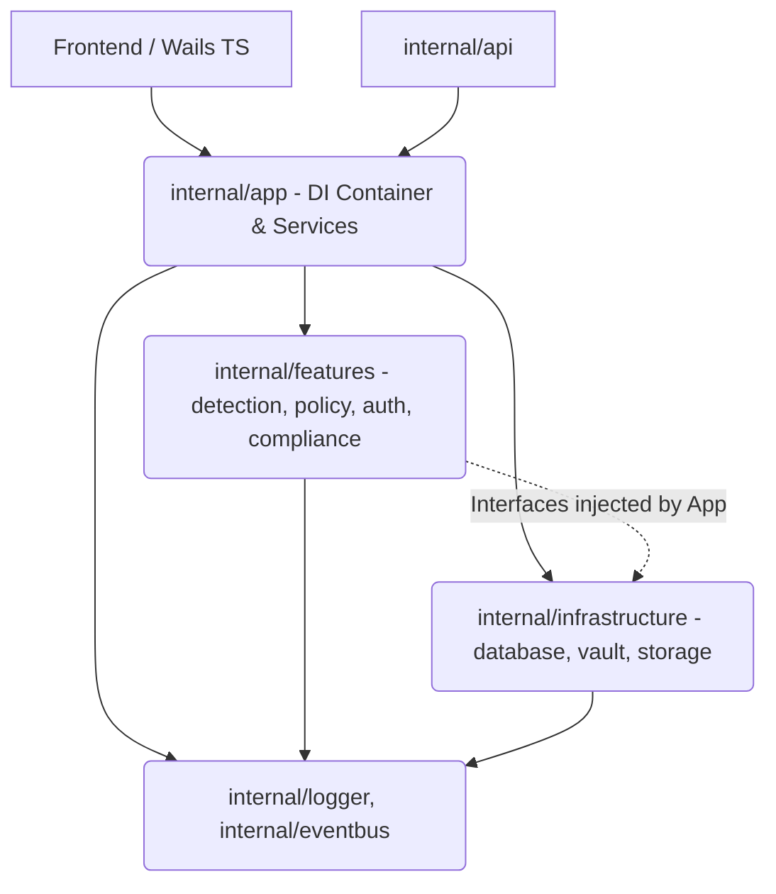

# Architectural Boundaries

This document defines the strict horizontal and vertical layering of the OBLIVRA Sovereign Terminal codebase. Enforcing these boundaries prevents "spaghetti dependency graphs," making the codebase highly testable, modular, and enterprise-ready.

## Strict Layer Precedence

The application follows a strict topological ordering:

1. **`cmd`** (Executables / Entrypoint)
2. **`internal/app`** (Service Container, Orchestration, UI Bindings)
3. **`internal/api`** (Inbound HTTP entrypoints routing to services/eventbus)
4. **`internal/(feature)`** (Core Domain logic: `detection`, `policy`, `auth`, `compliance`, `analytics`, `security`)
5. **`internal/database`**, **`internal/vault`**, **`internal/storage`** (Persistance Infrastructure)
6. **`internal/logger`**, **`internal/eventbus`** (Core primitives - lowest level)

### Principles

*   **Downward Dependency Only**: A layer can only import from layers *below* it.
*   **No Circular Dependencies**: Go enforces this at the compiler level, but design-level circularity (like two features importing each other) is also discouraged.
*   **Interface Inversion**: If a lower layer (e.g., `detection`) needs to invoke an action in an upper layer or sibling layer (e.g., looking up a credential from `vault`), it must use an Interface injected at runtime inside `container.go`. `detection` **cannot** import `vault`.

## Boundary Rules

*   **`github.com/kingknull/oblivrashell/internal/app`**: Allowed to import anything. It wires the application.
*   **`github.com/kingknull/oblivrashell/internal/database`**: Cannot import `internal/app` or any feature logic packages. It focuses purely on SQL models.
*   **`github.com/kingknull/oblivrashell/internal/logger` & `internal/eventbus`**: Cannot import anything else inside `internal/*`. These are foundational legos.
*   **`github.com/kingknull/oblivrashell/internal/detection`**: Forbidden from importing `vault` or `database`.

## Architecture Diagram

## Testing

These boundaries are automatically enforced using Go's AST during CI execution:
`go test ./internal/architecture/...`
