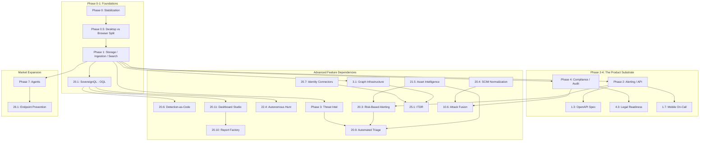

# OBLIVRA: Implementation Dependency Map (DAG)

This document visualizes the critical path for OBLIVRA development, identifying hard and soft dependencies between phases to prevent architectural stalls.

## Core Dependency Logic

## Critical Path for Productization (Sprint 1)

These items form the minimum viable sequence for a first production customer:

1.  **Phase 0.5** (Architecture Split) → Essential for defining deployment.
2.  **Phase 1.3** (OpenAPI) → Unblocks integration conversations.
3.  **Phase 1.2/1.6** (Docs & Accessibility) → Required for procurement.
4.  **Phase 20.18** (Entity Pages) → Primary investigation interface.
5.  **Phase 4.1/4.2** (POC Generator & Support bundle) → Commercial readiness.

## Known Conflicts & Resolution

| Conflict Point | Description | Resolution Plan |
| :--- | :--- | :--- |
| **RBA vs Asset Intel** | Phase 20.3 (RBA) needs Asset Criticality (Phase 21.5). | Implement "Scaffolded" Asset Intel (Phase 21.5) as a prerequisite for RBA. |
| **Triage Inputs** | Phase 20.9 (Triage) requires RBA, Threat Intel, and Asset Intel. | 20.9 cannot reach `Validated [v]` status until 20.3, 20.7, and 21.5 are `Scaffolded [s]`. |
| **OQL Everywhere** | Almost all advanced analytics (Dashboards, Hunting, Reports) depend on OQL. | **Tier 0 Priority**: OQL must reach `Production-Ready [x]` status before Phase 20.11 begins. |
